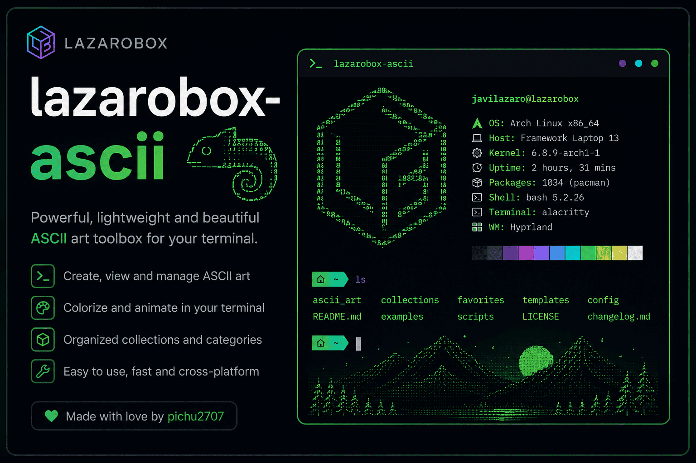

<p align="center">
  
</p>

<h1 align="center">LazaroBox ASCII</h1>

<p align="center">
  Conversor de imágenes a arte de terminal — ASCII, Braille y bloques Unicode.<br>
  CLI para automatizar · TUI con preview en vivo para afinar a ojo.
</p>

<p align="center">
  
  
  
  
</p>

---

Conversor de imágenes a arte de texto (ASCII / Braille / bloques Unicode) escrito en Rust.
Pensado para generar logos, banners, avatares, splash screens y cabeceras de README a
distintos tamaños, listos para pegar en una TUI (ratatui), la portada de Neovim, o un `.md`.

## ✨ Características

- 🎨 **Tres glifos** — `ascii` (portable), `braille` (máximo detalle) y `blocks` (sólido).
- ⚡ **Presets calibrados** — `icon`, `avatar`, `readme`, `banner`, `logo`.
- 🖥️ **TUI con preview en vivo** — ajustás parámetros con el teclado y ves el resultado al instante.
- 📐 **Sin deformación** — el tamaño se mide en columnas y el alto se corrige por la relación de aspecto de la celda de terminal.
- 💾 **Doble exportación** — `.txt` (glifos crudos) y `.ans` (con color ANSI incrustado).

## 💡 Idea

El núcleo (`src/converter.rs`) es **agnóstico**: recibe una imagen y devuelve un `String`.
No sabe nada de la terminal, de ratatui ni de archivos. La CLI (`src/main.rs`) es solo un
adaptador encima. El diseño separa tres ejes independientes:

- **Glifo** — cómo un bloque de píxeles se vuelve carácter (ASCII / Braille / bloques).
- **Tamaño** — medido en **columnas**; el alto se deriva solo, corrigiendo la relación de
  aspecto de la celda de terminal (~2× más alta que ancha) para que la imagen **no salga
  deformada**.
- **Umbral** — para vaciar el fondo en modos monocromo y lograr el look "stencil".

## 📦 Instalación

Necesitás [Rust](https://rustup.rs) (edición 2024).

```bash
git clone https://github.com/pichu2707/lazaro-scii.git
cd lazaro-scii

# Compilar en modo release
cargo build --release

# O instalarlo en el PATH
cargo install --path .
```

El binario queda en `target/release/lazarobox-ascii`.

## 🖥️ Uso

El binario necesita una imagen de entrada. Con `cargo run`, separá los argumentos con `--`:

```bash
cargo run --release -- entrada.png --preset logo -o salida.txt
```

O directamente el binario ya compilado:

```bash
./target/release/lazarobox-ascii entrada.png --preset logo -o salida.txt
```

Sin `-o`, imprime por stdout.

## 🎛️ Modo interactivo (TUI)

Al ejecutar la herramienta **sin argumentos** arranca en la pantalla de bienvenida
(título + logo), desde donde eliges la imagen con un **selector de archivos** y pasas
al editor:

```bash
cargo run --release            # bienvenida → selector → editor
```

También puedes abrir el editor directamente sobre una imagen con `--tui`, con **preview
en vivo**: ajustas los parámetros con el teclado y ves el resultado al instante.

```bash
cargo run --release -- entrada.png --tui
# o partiendo de un preset:
cargo run --release -- entrada.png --preset logo --tui
```

Flujo: **Bienvenida** (`Enter` para elegir) → **Selector** (`↑↓` mover, `Enter`
abrir/elegir, `⌫` subir carpeta) → **Editor**. En el editor, `Esc` vuelve al selector
para cargar otra imagen.

Controles:

| Tecla    | Acción                                     |
| -------- | ------------------------------------------ |
| `g`      | Cambia de glifo (ASCII → Braille → Blocks) |
| `← →`    | Ancho en columnas                          |
| `↑ ↓`    | Umbral                                     |
| `i`      | Invierte claro/oscuro                      |
| `c`      | Color de acento                            |
| `h`      | Muestra/oculta el panel de guía            |
| `s`      | Exporta (`<nombre>.txt` + `<nombre>.ans`)  |
| `q`      | Salir                                      |

Al exportar genera **dos archivos**:

- `.txt` — glifos crudos monocromo. Para pegar en otra TUI (ratatui) y aplicarle tu
  propio `Style`, o en cualquier `.md`.
- `.ans` — con el color de acento ya incrustado (ANSI truecolor). Para `cat`, README que
  renderice ANSI, o mostrar en la terminal.

> El TUI necesita una terminal real (usa raw mode). No corre por pipes ni en CI.

## 🎚️ Presets

Cada preset fija `cols` + `glyph` + `threshold` calibrados. Cualquier flag explícito lo pisa.

| `--preset` | cols | glifo   | Caso de uso                     |
| ---------- | ---- | ------- | ------------------------------- |
| `icon`     | 24   | braille | Iconos                          |
| `avatar`   | 40   | braille | Avatares / thumbnails           |
| `readme`   | 80   | ascii   | Cabecera de README (copia-pega) |
| `banner`   | 120  | blocks  | Banner de GitHub / splash       |
| `logo`     | 60   | braille | Logo tipo stencil               |

## 🚩 Flags

| Flag              | Descripción                                                       | Default   |
| ----------------- | ---------------------------------------------------------------- | --------- |
| `--preset <p>`    | Preset por caso de uso (ver tabla).                              | —         |
| `--cols <n>`      | Ancho en columnas. El alto se calcula solo.                      | 80        |
| `--glyph <g>`     | `ascii`, `braille` o `blocks`.                                   | `braille` |
| `--threshold <n>` | Umbral 0-255 para Braille/Blocks. El fondo queda vacío por debajo. | 128       |
| `--invert`        | Invierte claro/oscuro.                                           | off       |
| `-o, --out <f>`   | Archivo de salida. Sin esto, imprime por stdout.                | stdout    |

## 🔤 Glifos

- **`ascii`** — rampa de densidad (`" .:-=+*#%@"`), 1 píxel por celda. Portable, se copia y
  pega en cualquier lado. Ideal para README.
- **`braille`** — 2×4 subpíxeles por celda (bloque Unicode U+2800). Máximo detalle, look de
  puntitos. Ideal para logos e iconos chicos donde cada píxel cuenta.
- **`blocks`** — bloques de cuadrante 2×2. Look sólido tipo stencil.

## 🎯 Valores recomendados (calidad)

Punto de partida por caso de uso. Ajustá desde acá según tu imagen.

| Caso de uso | `--cols` | glifo   | Notas                                         |
| ----------- | -------- | ------- | --------------------------------------------- |
| Icono       | 24       | braille | Alto detalle en poco espacio.                 |
| Avatar      | 40       | braille | Thumbnail reconocible.                        |
| README      | 80       | ascii   | Portable, copia-pega en cualquier `.md`.      |
| Banner      | 120      | blocks  | Ancho, sólido, buen impacto visual.           |
| Logo        | 60       | braille | Stencil limpio; subí el umbral si hace falta. |

Reglas para que salga con calidad:

- **Más `cols` = más detalle** (y más ancho de salida). Es la palanca principal.
- **Fondo transparente**: Braille y Blocks lucen mejor que ASCII. La transparencia se
  respeta automáticamente — el fondo queda vacío, no se rellena.
- **Sujeto claro sobre fondo oscuro**: NO uses `--invert`.
- **Umbral**: bajo = más relleno; subilo para limpiar el fondo en modos monocromo.

Esta misma guía aparece en el panel lateral del modo `--tui`.

## 💡 Tips

- **El tamaño se mide en columnas, no en píxeles.** Pasá solo `--cols`; el alto se ajusta
  para mantener la proporción real.
- **Sujeto claro sobre fondo oscuro → SIN `--invert`.** Invertir enciende todo el fondo.
  Usá `--invert` solo cuando el sujeto es oscuro sobre fondo claro.
- **Recortá la fuente al sujeto.** No le pases un screenshot entero: el sujeto queda chico
  y pierde detalle.
- Subí o bajá `--threshold` para controlar cuánto detalle entra en los modos monocromo.

## 📕 Ejemplos

```bash
# Logo stencil guardado a archivo
cargo run --release -- lobo.png --preset logo -o lobo.txt

# Banner ancho, override del preset
cargo run --release -- lobo.png --preset banner --cols 100

# ASCII portable para README, sujeto oscuro sobre fondo claro
cargo run --release -- foto.png --glyph ascii --invert
```

## 📄 Licencia

[MIT](LICENSE) © pichu2707

---

<p align="center">Hecho con 🦀 · <b>LazaroBox</b></p>
